# Beatify Deployment Guide

This document describes a production-style deployment setup for Beatify using Docker, NGINX, Gunicorn, and GitHub Actions.

## Tools and Frameworks

- Docker: packages the API and dependencies into reproducible containers.
- Docker Compose: orchestrates multi-service local/prod-like environment.
- Gunicorn (WSGI application server): runs the Flask app in production mode.
- NGINX (web server / reverse proxy): serves static files and forwards API traffic to Gunicorn.
- GitHub Actions: runs CI tests and builds/pushes Docker image to GHCR.
- GHCR (GitHub Container Registry): stores the built deployment image.

## Architecture Diagram

```mermaid
flowchart LR
    Client[Client Browser / API Consumer]
  NGINX[NGINX Web Server\nport 80]
  GUNICORN[Gunicorn WSGI\nBeatify.wsgi:app\nport 5000]
    SQLITE[(SQLite DB\ninstance/test.db)]
    GHA[GitHub Actions CI/CD]
    GHCR[GHCR Container Registry]
    CLOUD[Cloud Runtime\nRender/Railway/VM]

    Client -->|HTTP/HTTPS| NGINX
    NGINX -->|HTTP proxy| GUNICORN
    GUNICORN -->|SQLAlchemy| SQLITE

    GHA -->|build/push image| GHCR
    GHCR -->|pull image| CLOUD
    CLOUD -->|public endpoint| Client
```



## Why This Stack

- Application Server: Flask is executed by Gunicorn (WSGI), not the Flask debug server.
- Web Server: NGINX handles edge HTTP traffic and serves `/static` content directly.
- Process startup: Docker entrypoint runs Gunicorn directly.

## Local Deployment with Docker Compose

Run from project root:

```bash
docker compose up --build
```

API endpoint:

```text
http://localhost:5000/Beatify/api/v1/artists
```

Swagger UI:

```text
http://localhost:5000/Beatify/api/v1/docs
```

OpenAPI spec:

```text
http://localhost:5000/Beatify/api/v1/openapi.yaml
```

Root endpoint:

```text
http://localhost:5000/
```

Stop services:

```bash
docker compose down
```

## GitHub Actions CI/CD

Workflow file:

- `.github/workflows/ci-cd.yml`

Pipeline behavior:

- On PR and push: run tests (`pytest`) with coverage.
- On push to `main`: build Docker image and push to GHCR.
- Optional deploy hook: if `RENDER_DEPLOY_HOOK` secret is defined, it triggers cloud redeploy.

## GitHub Secrets (for deployment)

Set these in repository settings:

- `RENDER_DEPLOY_HOOK` (optional): Render deploy hook URL.

No extra secret is needed for GHCR push because workflow uses `GITHUB_TOKEN`.

## Cloud Deployment Notes

You can deploy the GHCR image on services such as Render, Railway, Fly.io, or your own VM.

Minimum production settings to configure on your host platform:

- Public port mapping to NGINX (`80` in container).
- Persistent storage for `instance/` if SQLite data should survive restarts.
- Environment variables as needed:
  - `INIT_DB=true|false`
  - `POPULATE_DB=true|false`
    - Current default in Compose is `POPULATE_DB=true` (seeds sample data on first startup)

## Oracle Cloud VM Deployment (Current Production)
The API was deployed on Oracle Cloud Free Tier.
Public URL: http://130.162.240.153:5000/ , public IP: 130.162.240.153

## VM setup Via Oracle Cloud
1. Create Oracle Cloud account at cloud.oracle.com
   - Home region should be Frankfurt (If deploying from Finland)
   - Credit card information is used for just verification, no actual fees when using free account, just a small checkup that is returned if I understood correctly
3. Configure VCN (Virtual Cloud network)
   - Top left 3 horizontal lines -> Networking -> Virtual cloud networks
   - Create VCN
   - You can name it
   - IPv4 CIDR Blocks -> 10.0.0.0/16
   - Other settings default
   - Create VCN
4. Open port in Oracle Cloud
   - Go to VCN -> Click the VCN you created -> Security tab -> Default Security List for "name of VCN"
   - -> Security rules tab -> Ingress Rules -> Add Ingress Rules -> Source CIDR 0.0.0.0/0, TCP, Destination port Range: 5000, other settings default -> Add Ingress Rules,
   - At the same time check that there is a ingress rule for TCP, Destination Port Range 22, Source 0.0.0.0/0, if not, create it as you did previously with port 5000
4. Configure VCN Subnets
   - Click the created VCN
   - Go to subnet section
   - Create subnet
   - You can name it
   - IPv4 CIDR Block -> 10.0.1.0/24
   - Subnet Access -> Public Subnet
   - Everything else default
5. Create an Internet Gateway
   - Go to your created VCN page -> Gateways tab
   - Internet gateways -> Create Internet Gateway
   - Name it, everything else default -> Create Internet Gateway
6. Add a route table
   - In the same VCN, which you created, go to Routing tab
   - Default Route Table for "the name of the VCM" -> Go to Route Rules tab
   - Add Route Rules -> Target type: Internet Gateway, Destination CIDR: 0.0.0.0/0, Target Internet Gateway: select the igw you created previously, other settings default
5. Create Compute Instance
   - Top left 3 horizontal lines -> Compute -> Instances
   - Create instance
   - You can name your instance
   - Image and shape -> Change image to Canonical Ubuntu 22.04
   - Other settings default in basic information
   - Security -> Default settings
   - Networking -> Primary VNIC -> You can name it
   - Subnet -> Select existing subnet -> Subnet should be the subnet you created previously
   - SSH Keys -> Generate a key pair for me -> download private and public key, store these in your local drive
   - Other settings in networking default
   - Storage settings default
   - Review and create the instance
6. Things needed from the VM
   - Public IP is found in the VM that you created

## API deployment via cmd
1. Open terminal, for example, cmd and launch VM
    - Use command -> ssh -i /path/to/your/private-key.key ubuntu@YOUR_PUBLIC_IP or ssh -i \path\to\private-key.key ubuntu@YOUR_PUBLIC_IP
    - If admin/permission issues do -> icacls C:\ssh_for_beatify\ssh-key-2026-04-06.key /inheritance:r , then icacls C:\ssh_for_beatify\ssh-key-2026-04-06.key /grant:r "%USERNAME%:R"
    - If still problems, do -> ssh -v -i /path/to/your/private-key.key ubuntu@YOUR_PUBLIC_IP
2. Update the VM system
    - run command sudo apt update && sudo apt upgrade -y
    - if new kernel available, just default settings and press ok (enter)
3. Install Docker
    - sudo apt install -y docker.io docker-compose
4. Clone your repository from github
    - git clone https://github.com/YOUR_GITHUB_USERNAME/YOUR_REPO_NAME.git
    - move to your repository file in VM -> cd YOUR_REPO_NAME
    - Repo name can be easily accessed via command ls
5. Open port in Ubuntu firewall -> Run command sudo iptables -I INPUT -p tcp --dport 5000 -j ACCEPT
6. And then to build and run docker compose -> Run command sudo docker-compose up --build -d
7. Verify deployment is working
    - curl http://YOUR_PUBLIC_IP:5000/
    - Or open in browser: http://130.162.240.153:5000/
    - Should return Beatify API info JSON
8. When you want to stop the dockers, do -> Run command sudo docker-compose down

## HTTPS
This deployment uses HTTP only, because the HTTPS is outside the scope of this project.

## Updating the VM
Remember to update the VM if github changes are made - sudo docker-compose down, git pull, sudo docker-compose up --build -d

## Documentation and API Criteria Checklist Support

This deployment setup directly supports criteria for:

- VM/Docker isolation.
- Use of web server + application server.
- Monitor/control system.
- Architecture diagram.
- Tooling description.

For API documentation criteria (OpenAPI validity, examples, response codes), maintain the OpenAPI spec at `docs/openapi.yaml` and validate it with Swagger Editor and:

```bash
python -m openapi_spec_validator docs/openapi.yaml
```
